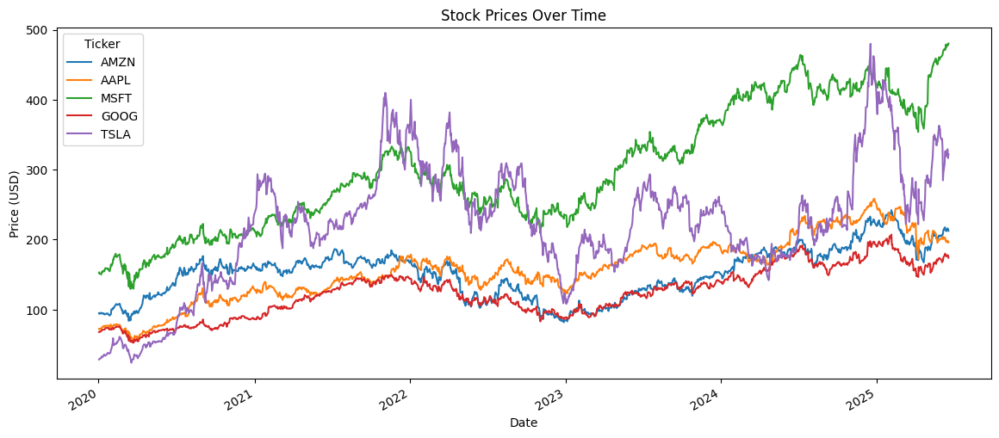

# 📊 Stock Market Analytics & Portfolio Optimization

A complete data analytics and machine learning project analyzing U.S. tech stocks to understand trends, assess risk, and build an optimized investment portfolio.

## 🚀 Project Objectives

- Analyze multi-year price data of major tech stocks (AAPL, MSFT, GOOG, AMZN, TSLA)
- Perform Exploratory Data Analysis (EDA) to uncover price trends, returns, and correlations
- Predict short-term market movement using machine learning (Random Forest)
- Calculate risk metrics (volatility, Sharpe Ratio)
- Optimize portfolio allocation using Modern Portfolio Theory

---

---

## 🛠️ Tools & Libraries Used

- **Python**, **Pandas**, **NumPy**
- **Matplotlib**, **Seaborn** – Visualization
- **yfinance** – Stock data collection
- **scikit-learn** – Machine Learning (Random Forest)
- **PyPortfolioOpt** – Portfolio optimization

---

## 📈 Key Highlights

- 📥 Collected and processed real-world stock data using `yfinance`
- 📉 Visualized daily returns and stock correlations
- 🤖 Trained a Random Forest model to predict price direction (~70% accuracy)
- 🧮 Calculated Sharpe Ratios and created an efficient frontier
- 💼 Recommended risk-aware asset allocation strategies

---

---

## ✅ Skills Demonstrated

- Data wrangling and preprocessing  
- Feature engineering  
- Classification modeling  
- Risk analysis and performance metrics  
- Portfolio design using financial theory

---

## 📌 Author

**Vinay Tiwari**  
[LinkedIn](https://www.linkedin.com/in/vinaytiwari25) • [GitHub](https://github.com/Vinaytiwari25)

---

